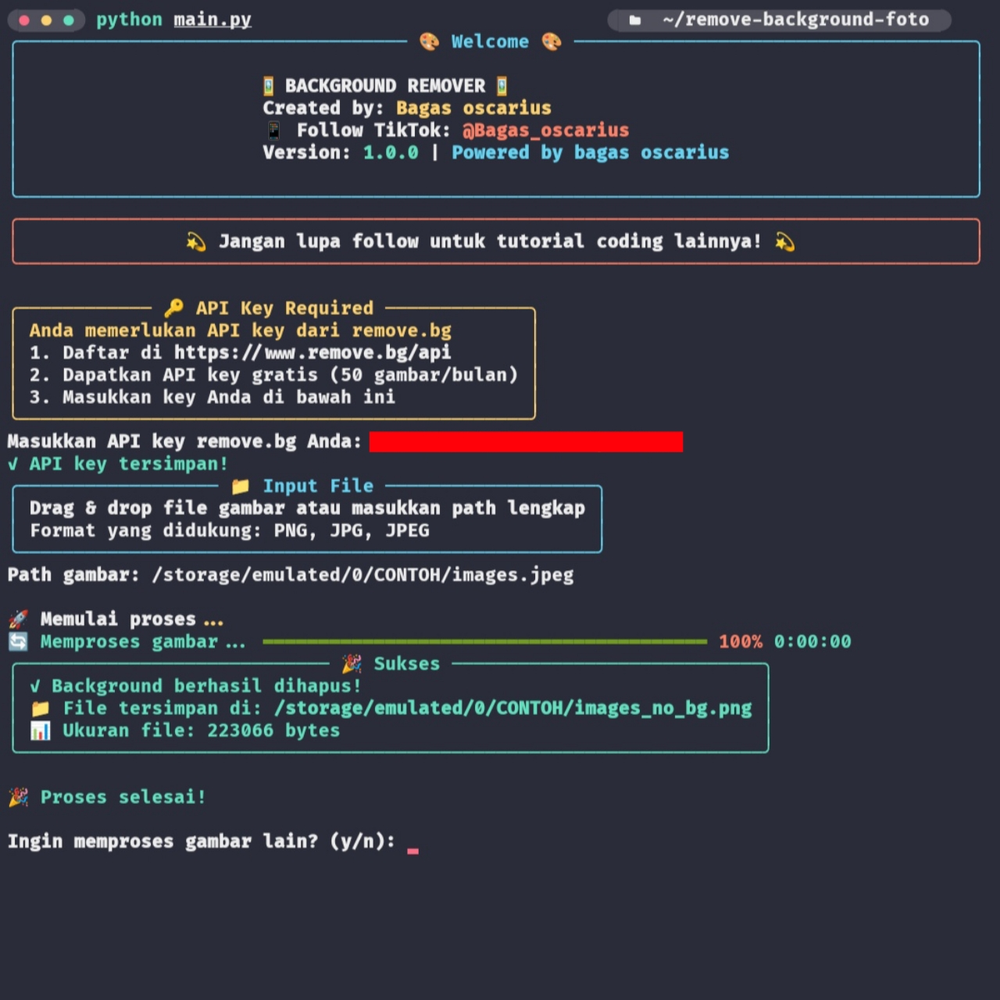

# REMOVE BACKGROUND API REMOVE.BG
Remove background" dalam bahasa Indonesia berarti menghapus latar belakang atau menghilangkan latar belakang

## DOWNLOAD TERMUX FDROID
* Unduh & Install Termux [`Klik Disini`](https://f-droid.org/repo/com.termux_118.apk)
### Instalation 
```makefile
pkg update -y && pkg upgrade -y && pkg install git python-pip tesseract && git clone https://github.com/WilDev26/Remove-Background.git && cd Remove-Background && pip install -r requirements.txt
```
## UNTUK MENJALAKAN COPY PERINTAH
```makefile
python3 Running.py
```
### BUG LAPORKAN
<a href="https://t.me/Bagas_ocarius" target=”_blank”></a>


[](https://buymeacoffee.com/Wildev26) 
[](https://paypal.me/wildev26)
